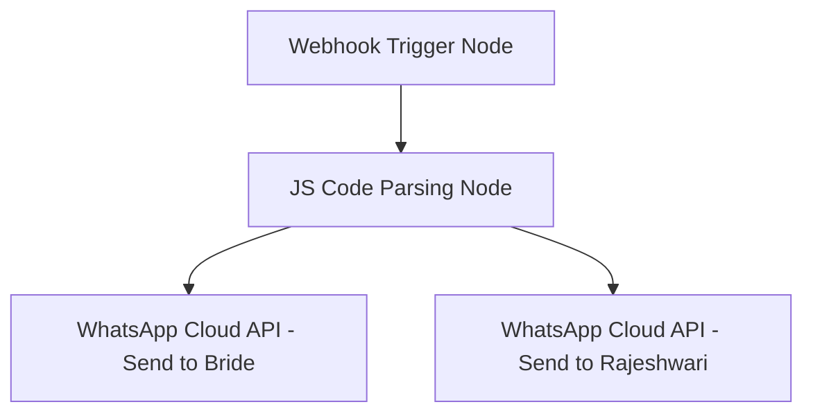

# n8n Webhook & WhatsApp API Automation Guide

This technical guide outlines the setup of the backend n8n workflow to handle automated WhatsApp notifications when a bride submits an availability inquiry through the **Bridal Concierge Platform**.

---

## 1. Webhook Setup (n8n Node 1)

Add a **Webhook** node as the trigger for your n8n workflow.

### Webhook Configuration:
- **HTTP Method:** `POST`
- **Path:** `mua-booking-inquiry`
- **Response Mode:** `onReceived`
- **Response Code:** `200`
- **Authentication:** `None` (or `Header Auth` if securing with custom headers)

### Webhook URLs:
- **Test URL (for debugging):** `https://n8n.yourdomain.com/webhook-test/mua-booking-inquiry`
- **Production URL:** `https://n8n.yourdomain.com/webhook/mua-booking-inquiry`

---

## 2. Sample JSON Submission Payload

When a bride submits the multi-event wizard, the frontend sends a structured JSON POST request containing nested events and quantities:

```json
{
  "inquiryId": "MUA-2026-4892",
  "submittedAt": "2026-05-28T16:00:00.000Z",
  "brideName": "Disha Gowda",
  "phone": "+91 98765 43210",
  "email": "disha.gowda@gmail.com",
  "city": "Bangalore",
  "weddingVenue": "The Leela Palace, Bangalore",
  "contactMethod": "WhatsApp",
  "events": [
    {
      "eventType": "Mehendi",
      "date": "2026-07-12",
      "time": "14:00",
      "makeupStyle": "Soft Glam",
      "addons": [
        {
          "id": "mother",
          "name": "Mother's Makeup",
          "category": "family",
          "quantity": 1,
          "price": 4000
        },
        {
          "id": "groom_touchup",
          "name": "Groom Touch-up Assistance",
          "category": "family",
          "quantity": 1,
          "price": 1500
        }
      ]
    },
    {
      "eventType": "Reception",
      "date": "2026-07-14",
      "time": "17:00",
      "makeupStyle": "Dewy Bridal",
      "addons": [
        {
          "id": "saree_draping",
          "name": "Saree Draping / Pleating",
          "category": "family",
          "quantity": 2,
          "price": 1000
        },
        {
          "id": "add_hairstyling",
          "name": "Additional Hair Extension & Styling",
          "category": "premium",
          "quantity": 1,
          "price": 2000
        }
      ]
    }
  ]
}
```

---

## 3. n8n Workflow Architecture



---

## 4. JS Parsing Node (n8n Node 2)

Add a **Code** node (running JavaScript) to parse the events and addons into clean, readable text lists suitable for WhatsApp formatting.

### JavaScript Code:
```javascript
const payload = items[0].json;

// 1. Format Client Event Summary
let clientEventText = "";
payload.events.forEach(evt => {
  clientEventText += `• *${evt.eventType}* — ${evt.date} at ${evt.time} (${evt.makeupStyle})\n`;
  if (evt.addons && evt.addons.length > 0) {
    evt.addons.forEach(add => {
      clientEventText += `  └ Add-on: ${add.name} (x${add.quantity})\n`;
    });
  }
});

// 2. Format Rajeshwari Detailed Brief
let artistBriefText = "";
payload.events.forEach((evt, idx) => {
  artistBriefText += `${idx + 1}. *${evt.eventType}* — ${evt.date} (${evt.time})\n`;
  artistBriefText += `   Style: ${evt.makeupStyle}\n`;
  if (evt.addons && evt.addons.length > 0) {
    artistBriefText += `   Add-ons:\n`;
    evt.addons.forEach(add => {
      artistBriefText += `   - ${add.name} (Qty: ${add.quantity})\n`;
    });
  } else {
    artistBriefText += `   Add-ons: None\n`;
  }
  artistBriefText += `\n`;
});

return [{
  json: {
    inquiryId: payload.inquiryId,
    brideName: payload.brideName,
    phone: payload.phone,
    email: payload.email,
    city: payload.city,
    venue: payload.weddingVenue,
    contactMethod: payload.contactMethod,
    clientEventText: clientEventText.trim(),
    artistBriefText: artistBriefText.trim()
  }
}];
```

---

## 5. WhatsApp API Integrations (n8n Nodes 3 & 4)

Add **HTTP Request** or **Twilio** nodes to execute API dispatch.

### Node A: Send Confirmation to Client
- **URL:** `https://graph.facebook.com/v19.0/YOUR_PHONE_NUMBER_ID/messages` (WhatsApp Cloud API)
- **Headers:** `Authorization: Bearer YOUR_ACCESS_TOKEN`
- **Method:** `POST`
- **JSON Body:**
```json
{
  "messaging_product": "whatsapp",
  "to": "={{$node[\"JS Code Node\"].json[\"phone\"]}}",
  "type": "text",
  "text": {
    "body": "Hi {{$node[\"JS Code Node\"].json[\"brideName\"]}} ✨\n\nThank you for contacting *Makeup Stories by Rajeshwari*.\n\nYour luxury bridal availability inquiry has been received successfully.\n\n*Booked Itinerary Summary:*\n{{$node[\"JS Code Node\"].json[\"clientEventText\"]}}\n\n*Preferred Contact:* {{$node[\"JS Code Node\"].json[\"contactMethod\"]}}\n\nRajeshwari's team will review your dates against outstation schedules and contact you shortly regarding booking lock and advance payments 💖."
  }
}
```

### Node B: Send Detailed Brief to Rajeshwari
- **URL:** `https://graph.facebook.com/v19.0/YOUR_PHONE_NUMBER_ID/messages`
- **Headers:** `Authorization: Bearer YOUR_ACCESS_TOKEN`
- **Method:** `POST`
- **JSON Body:**
```json
{
  "messaging_product": "whatsapp",
  "to": "YOUR_PERSONAL_WHATSAPP_NUMBER",
  "type": "text",
  "text": {
    "body": "🚨 *NEW BRIDAL CONCIERGE INQUIRY* 🚨\n\n*Bride Name:* {{$node[\"JS Code Node\"].json[\"brideName\"]}}\n*Phone:* {{$node[\"JS Code Node\"].json[\"phone\"]}}\n*Email:* {{$node[\"JS Code Node\"].json[\"email\"]}}\n*Location:* {{$node[\"JS Code Node\"].json[\"venue\"]}} ({{$node[\"JS Code Node\"].json[\"city\"]}})\n\n*EVENTS ITINERARY:*\n{{$node[\"JS Code Node\"].json[\"artistBriefText\"]}}\n\n*Preferred Contact Method:* {{$node[\"JS Code Node\"].json[\"contactMethod\"]}}"
  }
}
```
